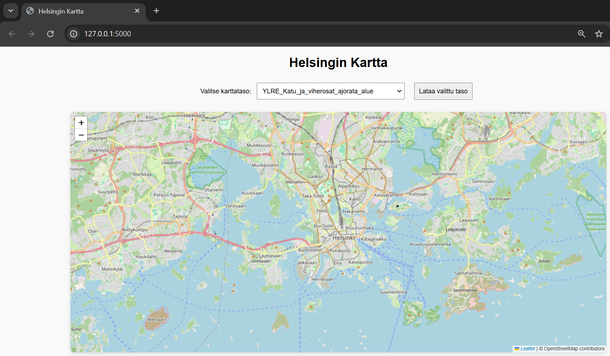
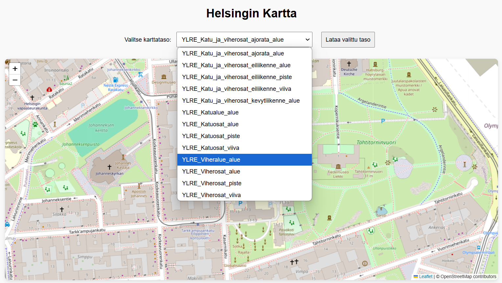
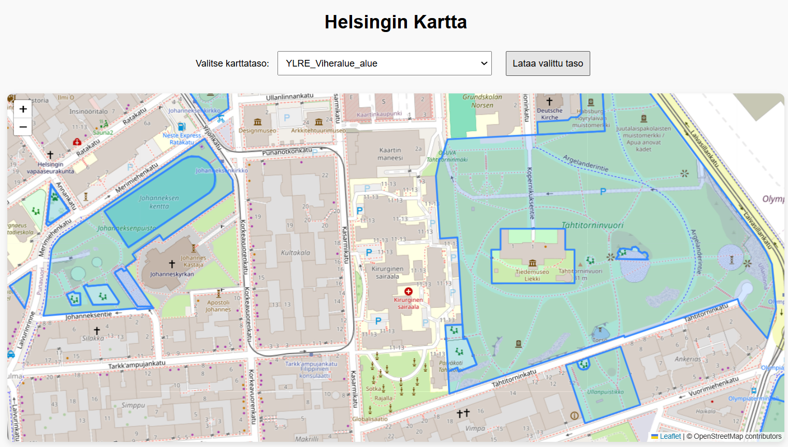

# Helsinki Paikkatieto - Karttasovellus

Tämä on tekoälyä hyödyntäen rakennettu paikkatietosovellus, joka visualisoi Helsingin kaupungin WFS-rajapinnasta haettuja karttatasoja Leaflet-kartalla. Sovellus on toteutettu Pythonilla Flask-kehyksen avulla ja se on suunniteltu helposti laajennettavaksi. Sovelluksen käyttöliittymässä voit valita ja ladata haluamasi WFS-tasot kartalle. Tasot haetaan Helsingin kaupungin WFS-rajapinnasta osoitteesta https://kartta.hel.fi/ws/geoserver/avoindata/wfs.

## Ominaisuudet

- Mahdollisuus valita ja ladata erilaisia Helsingin kaupungin tarjoamia WFS-tasoja.
- Leaflet-kartta, jossa WFS-tasot renderöidään dynaamisesti.

## Sovelluksen toiminta kuvina

Tältä sovellus näyttää selaimessa.

Karttaa on zoomattu: siinä näkyy Johanneksenkirkko ja Tähtitorninvuori. Pudotusvalikosta voidaan valita, mikä karttataso halutaan ladata kartalle, tässä tapauksessa YLRE_Viheralue_alue.

Klikkaamalla "Lataa valittu taso" sovellus ottaa yhteyden Helsingin kaupungin WFS-rajapintaan, hakee karttatason ja lataa sen kartalle.
